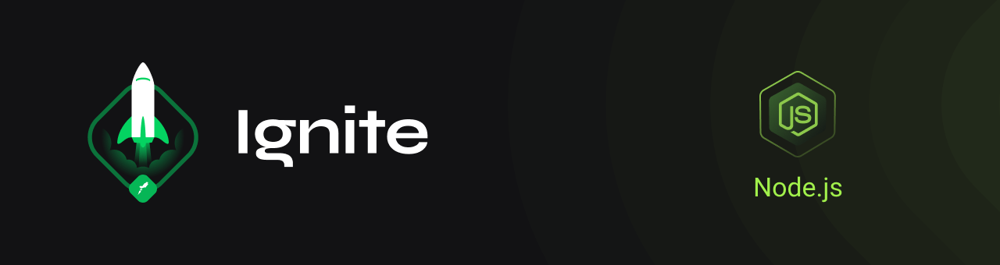

  

 

<h1 align="center">
  Desafio 2: testes de integração
</h1>

 

  
  
  
  
  
  

## :computer: Descrição:
Neste projeto foram desenvolvidos os testes de integração da FinAPI, uma abstração de uma aplicação financeira.

## :hammer_and_wrench: Funcionalidades:
- Criar um usuário com `name`, `email` e `password`;
- Autenticar um usuário a partir do `email` e `password` por meio de um `token` JWT;
- Listar informações de um usuário usando um `token`;
- Apresentar o saldo da conta de um usuário por meio de um `token`;
- Depositar um determinado valor em uma conta usando um `token`;
- Sacar um determinado valor em uma conta através de um `token`;
- Listar informações de uma determinada operação realizada utilizando um `token`.

## :memo: Execução do projeto:
- Instalação e execução do container do banco de dados:
  > docker-compose up
- Instalação das depêndencias do projeto:
  > yarn
- Execução dos testes:
  > yarn test
